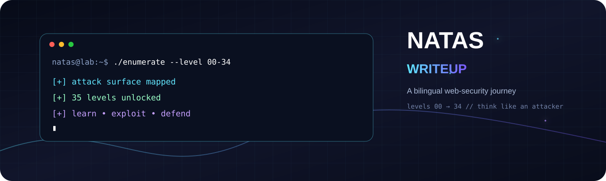

<div align="center">



<br>

<a href="https://overthewire.org/wargames/natas/"></a>
<a href="en-natas/index.html"></a>
<a href="fa-natas/index.html"></a>

<h1>⚡ Natas Writeup</h1>

<p><strong>Learn the vulnerability. Break the assumption. Build the defense.</strong></p>
<p>A bilingual, visual walkthrough of OverTheWire Natas — from source inspection to XXE, SQL injection, sessions, PHP internals, and beyond.</p>

</div>

[](https://overthewire.org/wargames/natas/)
[](https://github.com/here-is-leo/overthewire-natas)
[](https://github.com/here-is-leo/overthewire-natas/releases/latest)
[](https://github.com/here-is-leo/overthewire-natas/releases)
[](LICENSE)

[](https://developer.mozilla.org/en-US/docs/Web/HTML)
[](https://developer.mozilla.org/en-US/docs/Web/CSS)
[](https://github.com/here-is-leo/overthewire-natas/issues)

> A bilingual, hands-on walkthrough of the OverTheWire Natas web-security wargame, covering levels 00–34.

<div align="center">

| 🧩 35 Levels | 🌍 2 Languages | 🛠️ 6+ Core Tools | 🧠 Attack + Defense |
|:---:|:---:|:---:|:---:|
| `00 → 34` | `EN + FA` | `curl · Burp · Python` | `offense → remediation` |

</div>

<details>
<summary><strong>🎬 Open the quick-start briefing</strong></summary>

```text
┌──────────────────────────────────────────────────────────────────────┐
│  OBSERVE  →  FORM A HYPOTHESIS  →  TEST THE REQUEST  →  EXPLAIN WHY │
│      ↓              ↓                    ↓                 ↓          │
│  source/code     trust boundary      controlled lab       defense     │
└──────────────────────────────────────────────────────────────────────┘
```

</details>

<!-- TODO: Add a verified project banner or concept-map diagram. -->

## Table of Contents

- [About](#about)
- [Why Natas?](#why-natas)
- [Who Is This For?](#who-is-this-for)
- [What You’ll Learn](#what-youll-learn)
- [Project Stats](#project-stats)
- [How to Use This Repository](#how-to-use-this-repository)
- [Prerequisites](#prerequisites)
- [Levels Overview](#levels-overview)
- [Technologies and Tools](#technologies-and-tools)
- [Repository Structure](#repository-structure)
- [Key Security Lessons](#key-security-lessons)
- [Roadmap](#roadmap)
- [FAQ](#faq)
- [Related Resources](#related-resources)
- [Version History](#version-history)
- [Contributing](#contributing)
- [Disclaimer](#disclaimer)
- [License](#license)
- [Acknowledgments](#acknowledgments)
- [Author](#author)

## About

This repository documents the complete **Natas** wargame from [OverTheWire](https://overthewire.org/wargames/natas/), covering levels 00 through 34.

Every writeup connects four elements: what the application exposes, how to analyze its behavior, how the weakness is demonstrated in the authorized lab, and how the same class of flaw should be prevented in production.

The objective is not to memorize payloads. It is to build a repeatable method for inspecting web applications, testing assumptions, explaining impact, and translating offensive findings into defensive controls.

The project is available in **English** and **Persian (Farsi)**.

## Why Natas?

Natas provides a controlled progression through practical web-security concepts. It begins with source inspection and client-side trust, then moves through HTTP behavior, cookies, sessions, PHP, SQL, command execution, uploads, serialization, and XML parsing.

The game requires little setup and rewards careful manual analysis. By completing the series, readers learn to approach unfamiliar web challenges with a structured process instead of guesswork.

## Who Is This For?

- Beginners learning web-security fundamentals.
- Pentesters building manual-testing skills.
- CTF players practicing web exploitation.
- Developers learning how vulnerabilities work and how to prevent them.
- Students and educators seeking a structured practical path.
- Security-minded administrators studying insecure configuration patterns.

## What You’ll Learn

- Inspect HTML, JavaScript, cookies, headers, requests, and responses.
- Identify client-side controls that do not provide real security.
- Enumerate hidden files, directories, and configuration paths.
- Analyze cookies, sessions, Referer headers, and session identifiers.
- Understand PHP includes, type juggling, serialization, and object injection.
- Test path traversal, LFI, command injection, and filter bypasses.
- Work with SQL injection, UNION queries, stacked queries, and blind inference.
- Automate repetitive testing and data extraction with Python.
- Analyze insecure file-upload validation and XML external entities.
- Connect exploitation techniques to practical remediation.

## Project Stats

| Metric | Coverage |
|---|---|
| Levels | 35 levels: 00–34 |
| Languages | English and Persian |
| Format | Static HTML writeups |
| Platform | OverTheWire Natas |
| Tools | Browser DevTools, `curl`, Burp Suite, Python, Netcat |
| Estimated study time | <!-- TODO: add measured estimate --> |
| Author | Leo / Ilya Farahani |

### Recognition / Mentions

<!-- TODO: Add verified articles, talks, educational references, or community mentions. -->

## How to Use This Repository

1. Attempt each level in the [official Natas environment](https://overthewire.org/wargames/natas/) before opening its writeup.
2. Record what is visible, what is user-controlled, and what the server appears to trust.
3. Compare successful and unsuccessful requests.
4. Use the writeup to understand the reasoning, not only the final payload.
5. Reproduce techniques only in the authorized Natas environment.
6. Read the defensive guidance before moving to the next level.

The pages contain complete solutions and credentials for the training environment, so they include spoilers by design.

## Prerequisites

Required:

- A modern browser.
- Basic command-line familiarity.
- Basic understanding of HTTP requests and responses.
- Access to the official Natas game.

Recommended:

- `curl` and browser Developer Tools.
- Burp Suite Community or Professional.
- Basic Python scripting.
- Familiarity with HTML, JavaScript, PHP, SQL, and XML.

## Levels Overview

| Level | Topic | Primary technique or vulnerability | Difficulty |
|---:|---|---|---|
| 00 | HTML comment | Source inspection and information disclosure | 🟢 Very Easy |
| 01 | JavaScript | Client-side control bypass | 🟢 Very Easy |
| 02 | Directory listing | Hidden-file enumeration | 🟢 Very Easy |
| 03 | `robots.txt` | Configuration-based information disclosure | 🟢 Very Easy |
| 04 | HTTP Referer | Referer spoofing | 🟢 Easy |
| 05 | Cookies | Client-controlled authentication state | 🟢 Easy |
| 06 | PHP include | Source disclosure and insecure inclusion | 🟢 Easy |
| 07 | Path traversal | File path manipulation | 🟢 Easy |
| 08 | Encoding | Encoding and decoding bypass | 🟡 Medium |
| 09 | Command injection | Unsafe shell command construction | 🟡 Medium |
| 10 | Command injection | Filter bypass | 🟠 Hard |
| 11 | XOR encryption | Weak protection of client-side state | 🟠 Hard |
| 12 | File upload | Client-side validation bypass | 🟠 Hard |
| 13 | File upload | Server-side validation bypass | 🟠 Hard |
| 14 | SQL injection | Authentication bypass | 🟠 Hard |
| 15 | Blind SQL injection | Boolean-based inference | 🟠 Hard |
| 16 | Blind command injection | Inference through command execution | 🟠 Hard |
| 17 | Blind SQL injection | Time-based inference | 🟠 Hard |
| 18 | Session identifiers | Session ID prediction | 🟠 Hard |
| 19 | Session identifiers | Session ID encoding and analysis | 🟠 Hard |
| 20 | Session state | Session data injection | 🔴 Very Hard |
| 21 | Cross-site session | Cross-site session manipulation | 🔴 Very Hard |
| 22 | HTTP headers | Header injection and trust-boundary abuse | 🔴 Very Hard |
| 23 | PHP comparison | Type juggling | 🔴 Very Hard |
| 24 | PHP comparison | Advanced type juggling | 🔴 Very Hard |
| 25 | LFI | Log poisoning | 🔴 Very Hard |
| 26 | PHP internals | PHP object injection | 🔴 Very Hard |
| 27 | SQL injection | UNION-based injection | 🔴 Very Hard |
| 28 | SQL injection | Stacked queries | 🔴 Very Hard |
| 29 | Command injection | Advanced command execution | 🔴 Very Hard |
| 30 | SQL injection | Filter bypass | 🔴 Very Hard |
| 31 | File upload | Image verification and upload validation | 🔴 Very Hard |
| 32 | XXE | Basic external entity processing | 🔴 Very Hard |
| 33 | XXE | File inclusion through XML | 🔴 Very Hard |
| 34 | XXE | DTD-based exploitation | 🔴 Very Hard |

```text
35 levels total
├── 🟢 Very Easy : 4 levels  (00–03)
├── 🟢 Easy      : 4 levels  (04–07)
├── 🟡 Medium    : 2 levels  (08–09)
├── 🟠 Hard      : 10 levels (10–19)
└── 🔴 Very Hard : 15 levels (20–34)
```

## Technologies and Tools

| Category | Topics |
|---|---|
| Frontend | HTML, CSS, JavaScript, browser Developer Tools |
| Backend | PHP includes, sessions, serialization, type juggling |
| Database | SQL injection, blind SQL, UNION, stacked queries |
| System | Shell commands, command injection, metacharacters |
| Data formats | XML, XXE, JSON, Base64, hexadecimal |
| Network | HTTP headers, Referer, Location, cookies, sessions |
| Cryptography | XOR-based encryption, encoding and decoding |

| Tool | Purpose |
|---|---|
| Browser DevTools | Inspect source, cookies, requests, and responses |
| `curl` | Send repeatable requests with custom headers and cookies |
| Burp Suite | Intercept, modify, replay, and automate HTTP requests |
| Python | Automate blind injection and data extraction |
| Netcat / `nc` | Support authorized out-of-band XXE exercises |
| `xxd` / `base64` | Encode, decode, and inspect data |

## Repository Structure

```text
natas-writeup/
├── en-natas/
│   ├── index.html
│   ├── overview.html
│   └── Levels/en-00.html … en-34.html
├── fa-natas/
│   ├── index.html
│   ├── overview.html
│   └── Levels/fa-00.html … fa-34.html
├── Versions/CHANGELOG.md
├── assets/
│   ├── css/style.css
│   ├── js/main.js
│   └── images/logo.png
├── natas-structure.txt
├── README.md
└── .gitignore
```

<!-- TODO: Add screenshots of both language versions and one representative level page. -->

## Key Security Lessons

### 1. Treat client-side data as attacker-controlled

**Why it matters:** HTML, JavaScript, hidden fields, and cookies can be inspected or changed by the user.

**How to defend:** Enforce authentication, authorization, validation, and business rules on the server.

### 2. Server-side validation is the security boundary

**Why it matters:** Every browser-side control can be bypassed by a custom request.

**How to defend:** Validate type, format, range, ownership, and permissions on every request.

### 3. Obscurity is not access control

**Why it matters:** `robots.txt`, hidden UI elements, and unusual filenames do not prevent direct access.

**How to defend:** Protect resources with real authentication and authorization checks.

### 4. Parameterize every database query

**Why it matters:** Concatenated input can change SQL structure and query meaning.

**How to defend:** Use prepared statements, safe query APIs, and least-privilege database accounts.

### 5. Session identifiers must be unpredictable

**Why it matters:** Weak or predictable IDs can enable session hijacking and account takeover.

**How to defend:** Use cryptographically secure randomness, high entropy, secure cookies, and rotation after authentication.

### 6. Never deserialize untrusted data

**Why it matters:** Unsafe deserialization can trigger attacker-controlled object behavior.

**How to defend:** Avoid native object deserialization for untrusted input; prefer safe formats such as JSON with strict schemas.

### 7. File uploads require defense in depth

**Why it matters:** Filenames and MIME types are attacker-controlled and easy to spoof.

**How to defend:** Validate content and size, rename files, re-encode images, store uploads outside the web root, and disable execution.

### 8. Disable external XML entities

**Why it matters:** XXE can expose local files, trigger server-side requests, and cause denial of service.

**How to defend:** Disable external entities and DTD processing unless strictly required, then use a strict allowlist.

## Roadmap

- [ ] Add progressive hints and spoiler warnings.
- [ ] Add concept tags and cross-links between related levels.
- [ ] Add search and filtering to the level index.
- [ ] Add verified screenshots and request/response diagrams.
- [ ] Improve accessibility and keyboard navigation.
- [ ] Add automated link and HTML validation.
- [ ] Measure and publish an estimated study time.
- [ ] Add verified recognition and community mentions.

## FAQ

### Is this the official Natas solution?

No. Natas is maintained by [OverTheWire](https://overthewire.org/); this is an independent educational walkthrough.

### Should I read the writeup before attempting a level?

Attempt the level first. Use the writeup to validate your reasoning or recover from a well-defined blocker.

### Do I need Burp Suite?

No. A browser and `curl` are sufficient for many levels. Burp becomes useful for repeated request manipulation.

### Do I need to know PHP, SQL, or XML?

Not in advance, although basic familiarity makes the later levels easier.

### Can I run the project offline?

Yes. Open the HTML files locally or serve the repository with a local HTTP server.

### Are the included credentials safe to publish?

They belong to the public training environment. Do not reuse them outside the authorized Natas context.

### Can I contribute corrections or translations?

Yes. Technical corrections, translation improvements, accessibility fixes, and reproducible examples are welcome.

## Related Resources

- [OverTheWire Natas](https://overthewire.org/wargames/natas/)
- [OWASP Top 10](https://owasp.org/www-project-top-ten/)
- [OWASP Web Security Testing Guide](https://owasp.org/www-project-web-security-testing-guide/)
- [PortSwigger Web Security Academy](https://portswigger.net/web-security)
- [HackTricks](https://book.hacktricks.xyz/)
- [PayloadsAllTheThings](https://github.com/swisskyrepo/PayloadsAllTheThings)
- [MDN Web Docs](https://developer.mozilla.org/)
- [PHP Manual](https://www.php.net/manual/en/)
- [OWASP XXE Prevention Cheat Sheet](https://cheatsheetseries.owasp.org/cheatsheets/XML_External_Entity_Prevention_Cheat_Sheet.html)

## Version History

| Version | Date | Status | Download |
|---|---|---|---|
| **v0.6.0** | 2026-06-26 | Current | [Download](https://github.com/here-is-leo/overthewire-natas/releases/tag/v0.6.0) |
| **v0.5.0** | 2026-06-25 | Supported | [Download](https://github.com/here-is-leo/overthewire-natas/releases/tag/v0.5.0) |
| **v0.4.0** | 2026-06-23 | Supported | [Download](https://github.com/here-is-leo/overthewire-natas/releases/tag/v0.4.0) |
| **v0.3.0** | 2026-06-20 | Supported | [Download](https://github.com/here-is-leo/overthewire-natas/releases/tag/v0.3.0) |
| **v0.2.0** | 2026-06-17 | Supported | [Download](https://github.com/here-is-leo/overthewire-natas/releases/tag/v0.2.0) |
| **v0.1.0** | 2026-06-13 | Supported | [Download](https://github.com/here-is-leo/overthewire-natas/releases/tag/v0.1.0) |

See [CHANGELOG.md](Versions/CHANGELOG.md) for details.

## Installation and Usage

```bash
git clone https://github.com/here-is-leo/overthewire-natas.git
cd overthewire-natas
python3 -m http.server 8000
```

Open:

- `http://localhost:8000/en-natas/` — English.
- `http://localhost:8000/fa-natas/` — Persian.

<!-- TODO: Add the verified GitHub Pages URL. -->

## Contributing

Please open an issue for a reproducible problem or a pull request for a focused change. Include the affected level or file, the proposed correction, and how you verified it.

```bash
git checkout -b feature/meaningful-change
git add .
git commit -m "Describe the change"
git push origin feature/meaningful-change
```

## Disclaimer

This repository is intended for education, defensive research, and authorized security testing. Use the techniques only against the official Natas environment, systems you own, or systems for which you have explicit permission and a defined scope.

Do not use these examples to access, modify, disrupt, or extract data from unauthorized systems. The author and contributors are not responsible for misuse, damage, data loss, service interruption, or legal consequences resulting from this material. Follow applicable laws, contracts, and organizational policies.

## License

This project is distributed under the [MIT License](LICENSE).

Copyright © 2025 Leo (Ilya Farahani).

The complete license text is available in [LICENSE](LICENSE).

## Acknowledgments

- [OverTheWire](https://overthewire.org/) for creating Natas.
- [OWASP](https://owasp.org/) for open security guidance.
- [PortSwigger](https://portswigger.net/) for Burp Suite and Web Security Academy.
- The wider security community for sharing research and practical knowledge.

## Author

**Leo (Ilya Farahani)**

- GitHub: [github.com/here-is-leo](https://github.com/here-is-leo)
- LinkedIn: [linkedin.com/in/ilya-farahani-2160103b0](https://www.linkedin.com/in/ilya-farahani-2160103b0)
- Telegram: [t.me/Here_is_leo](https://t.me/Here_is_leo)
- Email: [ilyafarahanii@gmail.com](mailto:ilyafarahanii@gmail.com)

---

# راهنمای حل بازی Natas

> راهنمایی جامع، عملی و دوزبانه برای یادگیری امنیت برنامه‌های وب از طریق بازی Natas در پلتفرم OverTheWire.

## درباره پروژه

این مخزن راهنمای کامل بازی **Natas** از [OverTheWire](https://overthewire.org/wargames/natas/) است و همه سطوح ۰۰ تا ۳۴ را پوشش می‌دهد.

هر راهنما چهار موضوع را به هم پیوند می‌دهد: آنچه برنامه افشا می‌کند، روش تحلیل رفتار آن، نحوه بررسی آسیب‌پذیری در محیط مجاز، و راهکارهای جلوگیری از همان ضعف در نرم‌افزار واقعی.

هدف پروژه حفظ کردن Payloadها نیست؛ هدف، ساختن روشی منظم برای مشاهده، فرضیه‌سازی، آزمایش و توضیح آسیب‌پذیری‌هاست.

## چرا Natas؟

Natas مسیر آموزشی کنترل‌شده‌ای از بازرسی سورس و اعتماد به کلاینت تا HTTP، کوکی، نشست، PHP، SQL، اجرای فرمان، آپلود فایل، Serialization و XML فراهم می‌کند. برای شروع به محیط پیچیده‌ای نیاز ندارد و به‌جای اتکا به ابزارهای خودکار، تحلیل دستی را تقویت می‌کند.

## این پروژه برای چه کسانی است؟

- تازه‌کارهای امنیت وب.
- تسترهای نفوذ و بازیکنان CTF.
- توسعه‌دهندگانی که می‌خواهند علت و روش رفع آسیب‌پذیری‌ها را بفهمند.
- دانشجویان، مدرسان و مدیران سیستم.

## چه چیزهایی یاد می‌گیرید؟

- بررسی HTML، JavaScript، کوکی، هدر، درخواست و پاسخ.
- شناسایی کنترل‌های قابل دور زدن در سمت کلاینت.
- تحلیل Path Traversal، LFI، Command Injection و Filter Bypass.
- بررسی SQL Injection، UNION، Stacked Query و Blind SQL Injection.
- درک Session، Type Juggling، Serialization، Object Injection و XXE.
- خودکارسازی آزمایش‌ها و استخراج داده با Python.
- تبدیل یافته‌های تهاجمی به کنترل‌های دفاعی.

## آمار پروژه

| شاخص | مقدار |
|---|---|
| سطوح | ۳۵ سطح، از ۰۰ تا ۳۴ |
| زبان‌ها | انگلیسی و فارسی |
| قالب | راهنماهای HTML ایستا |
| نویسنده | لئو / ایلیا فراهانی |
| زمان مطالعه | <!-- TODO: پس از اندازه‌گیری تکمیل شود --> |

### افتخارات و اشاره‌ها

<!-- TODO: پس از تأیید، لینک مقاله‌ها، ارائه‌ها یا اشاره‌های معتبر را اضافه کنید. -->

## نحوه استفاده از مخزن

۱. هر سطح را ابتدا در محیط رسمی Natas امتحان کنید.
۲. مشاهدات، ورودی‌های قابل کنترل و تفاوت پاسخ‌ها را یادداشت کنید.
۳. راهنما را برای درک منطق تحلیل بخوانید، نه فقط کپی کردن Payload.
۴. تکنیک را تنها در محیط مجاز بازتولید کنید.
۵. بخش دفاعی را بخوانید و سپس به سطح بعد بروید.

## پیش‌نیازها

ضروری: مرورگر مدرن، آشنایی مقدماتی با خط فرمان، درک پایه HTTP و دسترسی به بازی رسمی Natas.

پیشنهادی: `curl`، ابزارهای توسعه‌دهنده مرورگر، Burp Suite، Python و آشنایی با HTML، JavaScript، PHP، SQL و XML.

## مرور سطوح

| سطح | موضوع | تکنیک یا آسیب‌پذیری | سختی |
|---:|---|---|---|
| ۰۰ | کامنت HTML | مشاهده سورس و افشای اطلاعات | 🟢 بسیار آسان |
| ۰۱ | JavaScript | دور زدن کنترل سمت کلاینت | 🟢 بسیار آسان |
| ۰۲ | فهرست دایرکتوری | کشف فایل پنهان | 🟢 بسیار آسان |
| ۰۳ | `robots.txt` | افشای اطلاعات پیکربندی | 🟢 بسیار آسان |
| ۰۴ | HTTP Referer | جعل Referer | 🟢 آسان |
| ۰۵ | کوکی | اعتماد به وضعیت کنترل‌شده توسط کلاینت | 🟢 آسان |
| ۰۶ | PHP Include | Include ناامن و افشای سورس | 🟢 آسان |
| ۰۷ | Path Traversal | دست‌کاری مسیر فایل | 🟢 آسان |
| ۰۸ | Encoding | دور زدن Encoding | 🟡 متوسط |
| ۰۹ | Command Injection | ساخت ناامن فرمان Shell | 🟡 متوسط |
| ۱۰ | Command Injection | دور زدن فیلتر | 🟠 سخت |
| ۱۱ | XOR | حفاظت ضعیف از وضعیت کلاینت | 🟠 سخت |
| ۱۲ | آپلود فایل | دور زدن اعتبارسنجی کلاینت | 🟠 سخت |
| ۱۳ | آپلود فایل | دور زدن اعتبارسنجی سرور | 🟠 سخت |
| ۱۴ | SQL Injection | دور زدن احراز هویت | 🟠 سخت |
| ۱۵ | Blind SQL Injection | استنتاج Boolean | 🟠 سخت |
| ۱۶ | Blind Command Injection | استنتاج از اجرای فرمان | 🟠 سخت |
| ۱۷ | Blind SQL Injection | استنتاج زمان‌محور | 🟠 سخت |
| ۱۸ | Session ID | پیش‌بینی شناسه نشست | 🟠 سخت |
| ۱۹ | Session ID | تحلیل Encoding شناسه نشست | 🟠 سخت |
| ۲۰ | Session Data | تزریق داده نشست | 🔴 بسیار سخت |
| ۲۱ | Cross-Site Session | دست‌کاری نشست بین‌سایتی | 🔴 بسیار سخت |
| ۲۲ | HTTP Headers | تزریق هدر | 🔴 بسیار سخت |
| ۲۳ | PHP | Type Juggling | 🔴 بسیار سخت |
| ۲۴ | PHP | Type Juggling پیشرفته | 🔴 بسیار سخت |
| ۲۵ | LFI | Log Poisoning | 🔴 بسیار سخت |
| ۲۶ | PHP | Object Injection | 🔴 بسیار سخت |
| ۲۷ | SQL | UNION Injection | 🔴 بسیار سخت |
| ۲۸ | SQL | Stacked Queries | 🔴 بسیار سخت |
| ۲۹ | Command Injection | اجرای فرمان پیشرفته | 🔴 بسیار سخت |
| ۳۰ | SQL | دور زدن فیلتر | 🔴 بسیار سخت |
| ۳۱ | آپلود فایل | بررسی تصویر | 🔴 بسیار سخت |
| ۳۲ | XXE | External Entity مقدماتی | 🔴 بسیار سخت |
| ۳۳ | XXE | File Inclusion از طریق XML | 🔴 بسیار سخت |
| ۳۴ | XXE | حمله مبتنی بر DTD | 🔴 بسیار سخت |

## درس‌های کلیدی امنیتی

### ۱. داده سمت کلاینت را غیرقابل اعتماد فرض کنید

**چرا مهم است:** کاربر می‌تواند HTML، JavaScript، فیلدهای مخفی و کوکی‌ها را تغییر دهد.

**چگونه دفاع کنیم:** احراز هویت، مجوزدهی و اعتبارسنجی را در سمت سرور انجام دهید.

### ۲. پنهان‌کاری، کنترل دسترسی نیست

**چرا مهم است:** `robots.txt` و عناصر مخفی مانع دسترسی مستقیم نمی‌شوند.

**چگونه دفاع کنیم:** منابع را با احراز هویت و مجوزدهی واقعی محافظت کنید.

### ۳. پرس‌وجوهای SQL را پارامتری کنید

**چرا مهم است:** اتصال رشته‌ها به ورودی کاربر ساختار SQL را قابل تغییر می‌کند.

**چگونه دفاع کنیم:** از Prepared Statement و حساب‌های کم‌دسترسی استفاده کنید.

### ۴. نشست باید غیرقابل پیش‌بینی باشد

**چرا مهم است:** شناسه ضعیف می‌تواند به ربایش نشست منجر شود.

**چگونه دفاع کنیم:** از تصادفی‌سازی رمزنگاری‌شده، آنتروپی بالا و چرخش شناسه استفاده کنید.

### ۵. داده غیرقابل اعتماد را Deserialize نکنید

**چرا مهم است:** Deserialization ناامن می‌تواند رفتار کنترل‌شده توسط مهاجم ایجاد کند.

**چگونه دفاع کنیم:** برای ورودی خارجی از JSON با Schema سخت‌گیرانه استفاده کنید.

### ۶. آپلود فایل به دفاع چندلایه نیاز دارد

**چرا مهم است:** نام فایل و MIME Type قابل جعل هستند.

**چگونه دفاع کنیم:** محتوا و اندازه را بررسی، فایل را تغییرنام، تصویر را بازکدگذاری و فایل را خارج از Web Root ذخیره کنید.

### ۷. External Entity را در XML غیرفعال کنید

**چرا مهم است:** XXE می‌تواند فایل محلی بخواند یا درخواست سمت سرور ایجاد کند.

**چگونه دفاع کنیم:** External Entity و DTD را غیرفعال و Parser را سخت‌گیرانه پیکربندی کنید.

## نقشه راه

- [ ] افزودن Hint و هشدار Spoiler.
- [ ] افزودن برچسب مفهومی و جست‌وجوی سطوح.
- [ ] افزودن Screenshot و نمودار درخواست/پاسخ.
- [ ] بهبود دسترس‌پذیری و ناوبری با صفحه‌کلید.
- [ ] افزودن اعتبارسنجی خودکار لینک‌ها و HTML.
- [ ] ثبت زمان مطالعه و اشاره‌های معتبر.

## پرسش‌های متداول

### آیا این راهنمای رسمی Natas است؟

خیر. این پروژه یک راهنمای مستقل برای محیط رسمی OverTheWire است.

### آیا باید Burp Suite داشته باشم؟

خیر. مرورگر و `curl` برای بسیاری از سطوح کافی هستند.

### آیا باید PHP، SQL یا XML بدانم؟

خیر؛ اما آشنایی مقدماتی با آن‌ها در سطوح پیشرفته کمک می‌کند.

### آیا مخزن را می‌توان آفلاین اجرا کرد؟

بله. فایل‌های HTML را باز کنید یا با `python3 -m http.server 8000` سرو کنید.

### آیا اطلاعات ورود را می‌توان خارج از Natas استفاده کرد؟

خیر. این اطلاعات فقط برای محیط آموزشی مجاز Natas هستند.

### آیا مشارکت در پروژه امکان‌پذیر است؟

بله. اصلاح فنی، بهبود ترجمه، رفع مشکل دسترس‌پذیری و افزودن مثال قابل بازتولید歓迎 است.

## منابع مرتبط

- [OverTheWire Natas](https://overthewire.org/wargames/natas/)
- [OWASP Top 10](https://owasp.org/www-project-top-ten/)
- [OWASP Web Security Testing Guide](https://owasp.org/www-project-web-security-testing-guide/)
- [PortSwigger Web Security Academy](https://portswigger.net/web-security)
- [HackTricks](https://book.hacktricks.xyz/)
- [PayloadsAllTheThings](https://github.com/swisskyrepo/PayloadsAllTheThings)
- [MDN Web Docs](https://developer.mozilla.org/)
- [PHP Manual](https://www.php.net/manual/en/)

## نصب و استفاده

```bash
git clone https://github.com/here-is-leo/overthewire-natas.git
cd overthewire-natas
python3 -m http.server 8000
```

- `http://localhost:8000/en-natas/` — نسخه انگلیسی
- `http://localhost:8000/fa-natas/` — نسخه فارسی

## مشارکت

برای تغییرات متمرکز، یک Issue یا Pull Request باز کنید و فایل، مشکل و روش بررسی را توضیح دهید.

```bash
git checkout -b feature/meaningful-change
git add .
git commit -m "Describe the change"
git push origin feature/meaningful-change
```

## رفع مسئولیت

این مخزن فقط برای آموزش، پژوهش دفاعی و تست امنیتی مجاز است. تکنیک‌ها را تنها روی محیط رسمی Natas، سامانه‌های متعلق به خودتان، یا سامانه‌هایی که برای آزمایش آن‌ها مجوز صریح و محدوده مشخص دارید استفاده کنید.

از دسترسی، تغییر، اختلال یا استخراج داده از سامانه‌های بدون مجوز خودداری کنید. نویسنده و مشارکت‌کنندگان در قبال سوءاستفاده، خسارت، از دست رفتن داده، اختلال سرویس یا پیامدهای قانونی مسئولیتی ندارند.

## مجوز

این پروژه تحت [مجوز MIT](LICENSE) منتشر شده است.

Copyright © 2025 Leo (Ilya Farahani).

متن کامل مجوز در فایل [LICENSE](LICENSE) قرار دارد.

## قدردانی

- [OverTheWire](https://overthewire.org/) برای ایجاد Natas.
- [OWASP](https://owasp.org/) برای منابع آموزشی امنیت.
- [PortSwigger](https://portswigger.net/) برای Burp Suite و Web Security Academy.
- جامعه امنیت اطلاعات برای اشتراک‌گذاری دانش و پژوهش.

## نویسنده

**لئو (ایلیا فراهانی)**

- گیت‌هاب: [github.com/here-is-leo](https://github.com/here-is-leo)
- لینکدین: [linkedin.com/in/ilya-farahani-2160103b0](https://www.linkedin.com/in/ilya-farahani-2160103b0)
- تلگرام: [t.me/Here_is_leo](https://t.me/Here_is_leo)
- ایمیل: [ilyafarahanii@gmail.com](mailto:ilyafarahanii@gmail.com)
